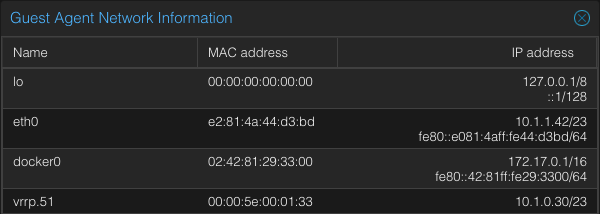
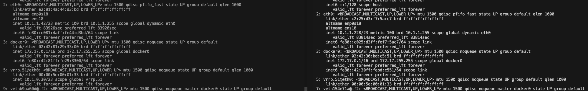

# haproxy-lb-basic-deployment
This example deployment shows a possible configuration using the haproxy-lb module to provision a 2 node TCP load balancer in Proxmox that listens on port 443 and load balances traffic to port 8443 on 4 different target IPs. 

This example uses DHCP for the haproxy nodes (which is the default setting if you don't provide a list of haproxy_ips) except for the lb_vip which must be static. After the HAProxy VMs are deployed you should be able to SSH onto the VMs that are stood up using the IPs assigned via DHCP and check which one has the VIP assigned to it. The VIP will be assigned to the node with the highest priority which will be the first one created (vm/hostname ends with `-0`) while all  of them are healthy. If the master node goes down or is unhealthy all the backups have a tie for priority which keepalived breaks based on the IP address assigned to them. When the master becomes healthy again it should pick up the VIP again.

After connecting to the HAProxy nodes you can run `cloud-init status --wait` to wait until cloud-init has finished running. Once cloud-init is running, you should be able to run `sudo systemctl status keepalived` to see the logs and status for keepalived. You can also run `ip a` to list all the interfaces and find the interface created by keepalived that will have the VIP assigned to it by the node that is currently the master. The interface with the VIP assigned should be named `vrrp.97@eth0` where `97` is the virtual router that was chosen when deploying.

Example screenshot of one of the haproxy VM networking information in the proxmox UI showing the VIP being assigned to the vrrp.51 interface:

## Testing failover
You can connect to the host of the master HAProxy VM and stop the HAProxy docker container to test one of the backups picking up the VIP.

Example showing the master and a backup while both are healthy:

After running `docker stop haproxy` on the left VM the one on the right picks up the VIP after a few seconds:

After running `docker start haproxy` on the master HAProxy node it should pick the VIP up again after a few seconds. No matter which HAProxy node has the VIP, your service that is being load balanced should be accessible through the VIP with minimal downtime during VIP switchover.

## SSH to current master
In my testing with the VM template I use, whichever HAProxy node has the VIP currently assigned only seems to accept new SSH connections to the VIP. So if you are trying to SSH to a HAProxy node via the DHCP assigned IP for that node and are getting a "no route to host" error, try connecting using the VIP instead. Note that your SSH connection will be interrupted if HAProxy were to go down because it would cause the VIP to be moved to a different node.

This is likely something that could be fixed by adjusting sshd settings.
