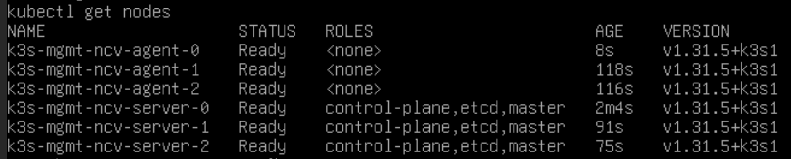

# k3s-example-deployment
This example deployment shows a possible configuration using the k3s module to deploy a k3s cluster in proxmox.

The example currently shows how you could use the module to deploy 3 server nodes and 3 agenet nodes with 1 server and 1 agent node VM running on each of 3 different proxmox hosts.

Output of `kubectl get nodes` a few minutes after the tofu apply finishes:

Screenshot of the resulting server and agent nodes running on one of the proxmox nodes:

For simple use cases, dedicated agent nodes aren't necessary and the list of proxmox hosts to deploy agent nodes to can be removed. Agent nodes can always be added later if more compute is needed.